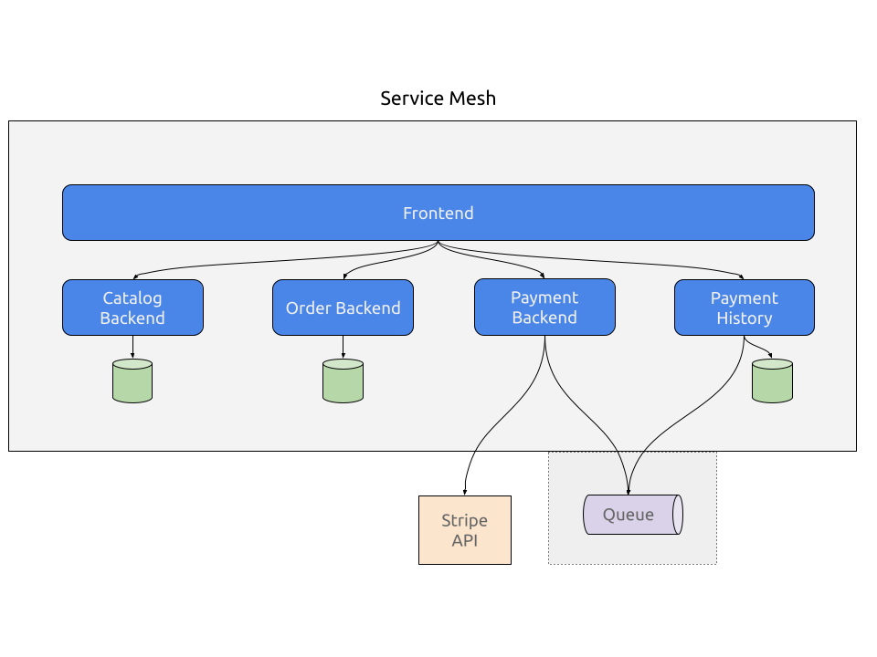

# ecommerce-demo

This is an example application to demonstrate Microservice constructs, such as:

- Microservices with Spring Boot
- RESTful clients and servers
- Database per microservice design
- Loose coupling through messaging

## How to run the projects

### Kubernetes

These microservices can be run in Kubernetes. There is an example set of YAML files and scripts in the [deploy](./deploy) directory.

The orders project uses the Stripe API to process credit cards. You will need to create a free developer account at the [Stripe Developer Dashboard](https://dashboard.stripe.com/register). Once you have your Stripe API key, update the stripe-secret.yaml file in the deploy directory. Make sure you Base64 encode your key in the file (`echo 'my-key' | base64`). Alternatively, you can set the secret with `kubectl` like this: `kubectl create secret generic paymentbackend -n catalog-demo --from-literal=stripe-api-key=<your-stripe-api-key>`

How you deploy to Kubernetes depends on your environment and requirements. You will probably want a Gateway or Ingress for frontend to access the site. The [deploy](./deploy) directory has sample YAML files that you can use for deployment.

### Locally

If you don't have a local Kubernetes cluster like kind or minikube, you can run the applications standalone. Here are the basic steps:

- Install a local instance of RabbitMQ, and update the `spring.rabbitmq.host` property in the application.properties file in [payment-history](payment-history) and [payments](payments).
- In each Spring Boot project, update the `server.port` value in the application.properties file to be unique amongst all of the microservices.
- Add an environment variable `STRIPE_API_KEY` with your Stripe API key [payments](payments) project. This should be plain text, not encoded.
- In the `CatalogController` class in the [frontend](frontend) project, update the constants containing the host names and ports for the endpoints for the REST services. These will most likely be localhost + unique port.
- Start each project with Maven: `mvn clean package spring-boot:run`.

## Testing

You can use the frontend project to test placing an order. For successful charges, you can use these test credit cards. Using other card numbers, an invalid month (e.g. 13), a year in the past, or a two digit cvc will cause a failure.

| NUMBER           | BRAND                       | CVC          | DATE            |
|------------------|-----------------------------|--------------|-----------------|
| 4242424242424242 | Visa                        | Any 3 digits | Any future date |
| 4000056655665556 | Visa (debit)                | Any 3 digits | Any future date |
| 5555555555554444 | Mastercard                  | Any 3 digits | Any future date |
| 2223003122003222 | Mastercard (2-series)       | Any 3 digits | Any future date |
| 5200828282828210 | Mastercard (debit)          | Any 3 digits | Any future date |
| 5105105105105100 | Mastercard (prepaid)        | Any 3 digits | Any future date |
| 378282246310005  | American Express            | Any 4 digits | Any future date |
| 371449635398431  | American Express            | Any 4 digits | Any future date |
| 6011111111111117 | Discover                    | Any 3 digits | Any future date |
| 6011000990139424 | Discover                    | Any 3 digits | Any future date |
| 3056930009020004 | Diners Club                 | Any 3 digits | Any future date |
| 36227206271667   | Diners Club (14 digit card) | Any 3 digits | Any future date |
| 3566002020360505 | JCB                         | Any 3 digits | Any future date |
| 6200000000000005 | UnionPay                    | Any 3 digits | Any future date |

## API
The [frontend](frontend) application exposes a number of API endpoints for automation\.The API documentation can be viewed [here](https://documenter.getpostman.com/view/1749839/UVyxQtit).

## Architecture

